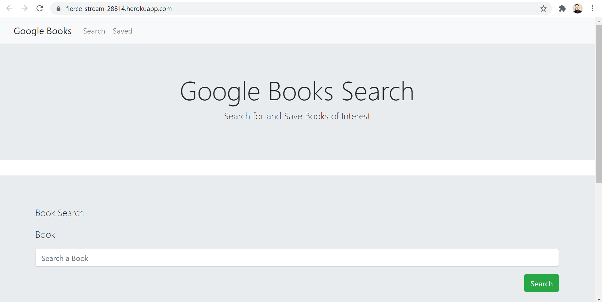
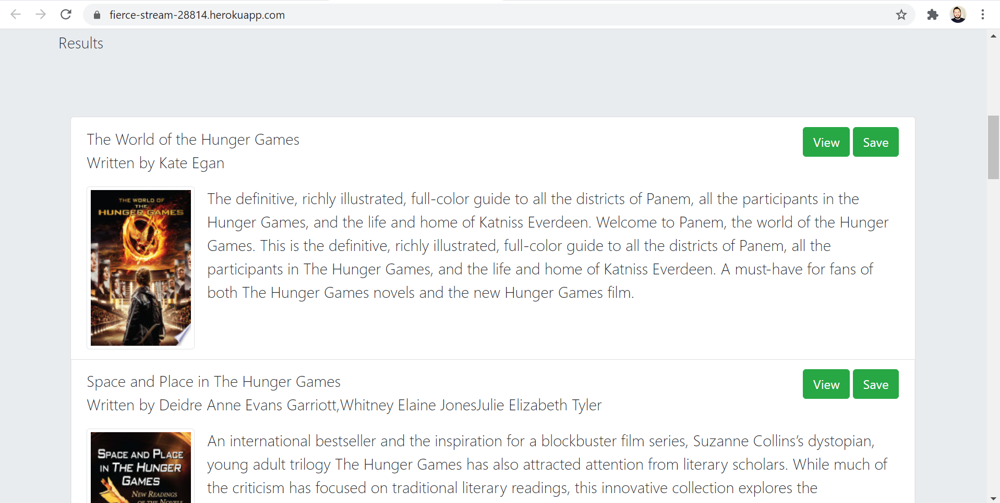
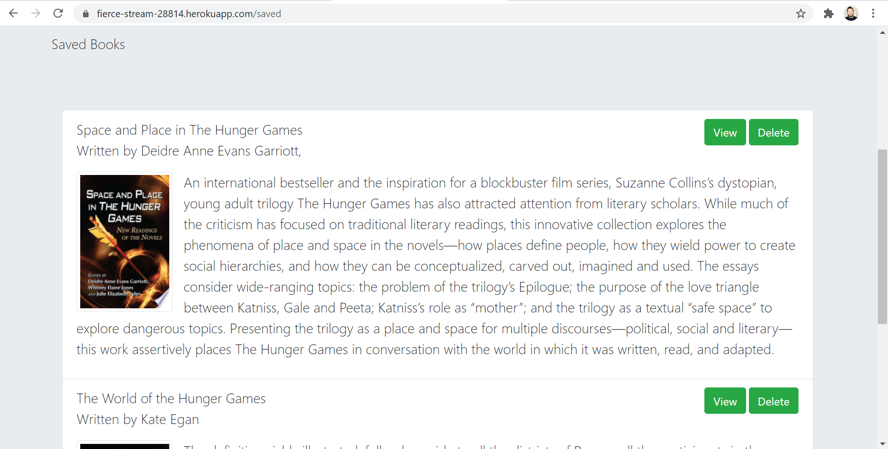

# Google Books Search

An application built to allow the user to search for a book and to save any of the books to be accessed later.

## What the project does

The project uses the Google Books API to provide results to users based on the query entered. It also allows users to save books to be accessed later and when looking at the saved books, the user can also delete any of the books. Below are some screenshots of the different areas of the page.

Landing page

Results section in landing page

Saved items in saved page

## Why is the project useful

Personally the project was a great experience for me on making an application using the MERN stack from scratch. For users, the application is useful in offering an option to search for books from the Google Play store and to be able to save them to keep track of them.

## How users can get started with the project

Simply navigate to the deployed version listed below to interact with it.

https://fierce-stream-28814.herokuapp.com/

## Where users can get help with your project

My GitHub username is: chavalk

Link: https://github.com/chavalk

If you have additional questions, feel free to reach me at chavalk@hotmail.com.

## Who maintains and contributes to the project

Currently I'm the only person maintaining and contributing to the project.